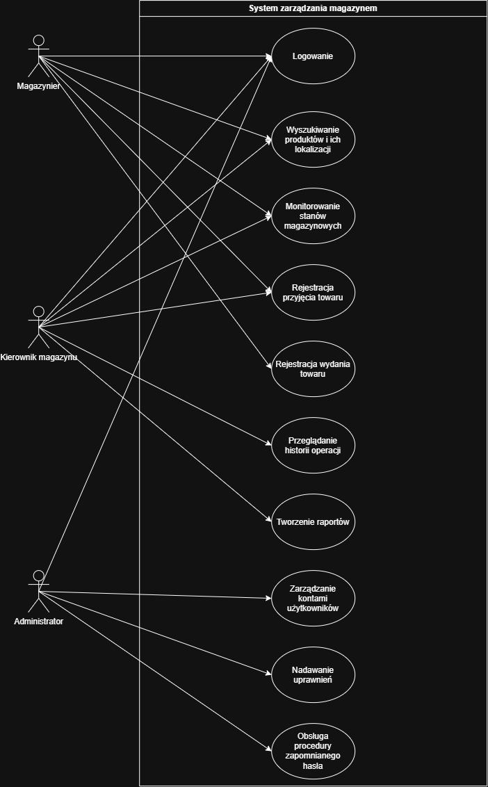

# Projekt: System Zarządzania Magazynem
**Przedmiot:** Projektowanie Oprogramowania
**Data:** <layout>followupButton(query="""Add this project deadline to my calendar""", label="""03.09.2026""", variant=FOLLOWUP_BUTTON_VARIANT_DATE_DROPDOWN)</layout>

---

## 1. Tabela wymagań funkcjonalnych (FR):

| ID | Nazwa wymagania | Opis wymagania |
| :--- | :--- | :--- |
| **1.1 FR-01** | Logowanie użytkownika | System powinien umożliwiać użytkownikowi zalogowanie się przy użyciu danych dostępowych. |
| **1.2 FR-02** | Wyszukiwanie informacji o produkcie i jego lokalizacja | Pracownik może znać kod EAN produktu albo jego nazwę. |
| **1.3 FR-03** | Monitorowanie stanów magazynowych | System powinien przechowywać aktualną ilość każdego produktu znajdującego się na magazynie. |
| **1.4 FR-04** | Stan magazynowy | System weryfikuje dostępność towaru i blokuje możliwość wydania większej liczby sztuk produktu, niż wynosi jego aktualny stan magazynowy. |
| **1.5 FR-05** | Rejestracja przyjęcia towaru | Pracownik powinien mieć możliwość zarejestrowania przyjęcia towaru np. jaki produkt został przyjęty, w jakiej ilości, kto wykonał operację, kto wykonał operację. |
| **1.6 FR-06** | Rejestracja wydania towaru | Pracownik powinien mieć możliwość rejestracji wydania towaru, zapisując dane: produkt, ilość, dane operacji (kto i kiedy wykonał). |
| **1.7 FR-07** | Przeglądanie historii towaru | System powinien przechowywać o wykonanych operacjach magazynowych i umożliwia kierownikowi ich sprawdzenie. |
| **1.8 FR-08** | Tworzenie raportów | System umożliwia kierownikowi uzyskiwania informacji dotyczących stanu i funkcjonowania magazynu. |

---

## 2. Tabela wymagań niefunkcjonalnych (NFR):

| ID | Kategoria / Nazwa wymagania | Opis wymagania |
| :--- | :--- | :--- |
| **2.1 NFR-01** | Wydajność | System powinien odpowiadać na operacje wyszukiwania produktu oraz obsługę kodu EAN w czasie nie dłuższym niż 1-2 sekundy w typowych warunkach pracy. |
| **2.2 NFR-02** | Integralność danych | System zapewnia poprawność i spójność danych w przypadku jednoczesnej próby modyfikacji tego samego produktu przez wielu pracowników magazynu (blokowanie rekordu). |
| **2.3 NFR-03** | Dostępność | System umożliwia bezpieczny dostęp do danych i raportów dla kierownika również poza jego stanowiskiem. |
| **2.4 NFR-04** | Bezpieczeństwo | Hasła użytkowników powinny być przechowywane w sposób bezpieczny, uniemożliwiający ich zwykły odczyt. |
| **2.5 NFR-05** | Sposób korzystania | System powinien zapewniać zrozumiały i sprawny interfejs podczas wykonywania codziennych operacji. |

---

## 3. Aktorzy:

### 3.1 - Magazynier
Zajmuje się bieżącą obsługą magazynu. Powinien mieć możliwość między innymi:
* wyszukiwania produktów,
* sprawdzania ich lokalizacji,
* przyjmowania towaru,
* wydawania towaru.

### 3.2 - Kierownik magazynu
Potrzebuje dostępu do szerszego zakresu informacji. Powinien mieć możliwość między innymi:
* przeglądania stanów magazynowych,
* zarządzania informacjami o produktach,
* przeglądania historii operacji,
* korzystania z raportów dotyczących magazynu.

### 3.3 - Administrator
Odpowiada za użytkowników systemu. Powinien mieć możliwość między innymi:
* zarządzania kontami użytkowników,
* nadawania odpowiednich uprawnień,
* obsługi sytuacji związanych z zapomnianym hasłem.

---

## 4. Diagram Przypadków Użycia (UML)

